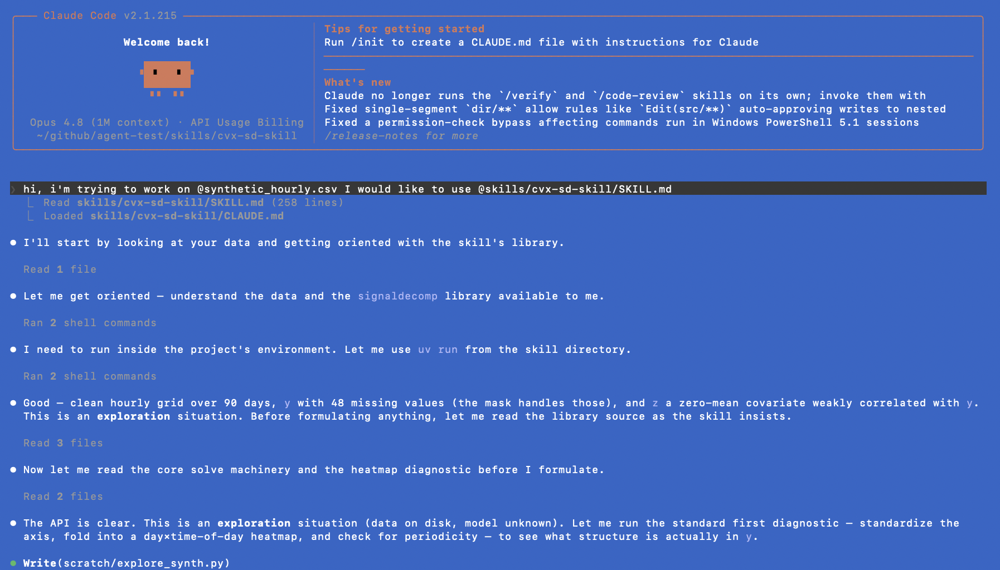
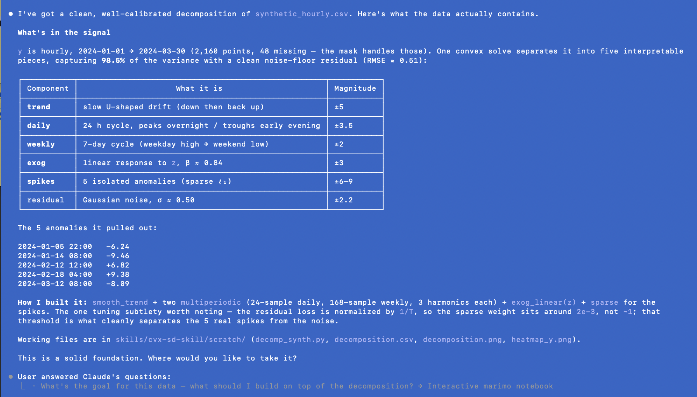

# Convex Signal Decomposition Skill

**Convex signal decomposition for scalar time series** — decompose a 1-D signal
into interpretable components (a residual plus a trend, periodic terms, sparse
spikes, exogenous responses, …) by solving one convex problem in
[CVXPY](https://www.cvxpy.org/).

> ⚠️ **Work in progress.** The core library is implemented and tested; the
> agent-facing skill and its reference material are being actively drafted. This
> repository is posted early to gather feedback on the direction. Interfaces and
> prose may change.

## What this is

Two things live here, and they're meant to work together:

1. **A small, tested Python library** (`signaldecomp`) that builds and solves
   masked signal-decomposition problems. Missing data is native — the
   consistency constraint is imposed only on observed entries, so the same
   mechanism handles gaps, held-out validation, and imputation.

2. **An agent skill** (`SKILL.md` + `reference/`) that teaches a
   capable language model to *formulate* signal decompositions well: to
   translate a domain problem into convex components, generate correct CVXPY,
   and wire the results back to interpretable outputs.

The design bet is that a capable model already knows convex optimization; what
it lacks is *consistency, footgun-immunity, and a verifiable target*. The
library is a correct substrate to build on; DCP (disciplined convex
programming) is the type system that catches malformed models before they
produce meaningless answers. Components are a **composable vocabulary**, not a
fixed menu — when a structure isn't in the catalog, you write the few lines of
CVXPY that express it.

It builds on the signal-decomposition framework of Meyers & Boyd (2023),
*[Signal Decomposition Using Masked Proximal Operators](https://doi.org/10.1561/2000000122)*,
recast around CVXPY as the modeling language and scoped (for now) to convex,
scalar-valued problems.

## Quick taste

```python
import numpy as np
from signaldecomp import (
    make_problem, solve, components_to_frame,
    smooth_trend, multiperiodic, period_samples,
    SECONDS_PER_DAY, SECONDS_PER_YEAR,
)

y = ...  # 1-D array on a regular grid, NaN where missing
delta = SECONDS_PER_DAY

built = make_problem(y, components=[
    smooth_trend(1e2, role="trend"),
    multiperiodic(period_samples(SECONDS_PER_YEAR, delta),
                  num_harmonics=4, role="seasonal"),
])
out = solve(built)
df = components_to_frame(out, y=y)   # labeled components, gaps imputed
```

## Potential agentic use

The code above is the *library*. The point of the **skill** is what a capable
agent can do with it — which is the part that answers "why an agent skill, not
just a package?" Here is a fresh context, cold: the user drops in a CSV and the
skill, nothing else.

> **User:** hi, i'm trying to work on `@synthetic_hourly.csv`. I would like to
> use `@skills/cvx-sd-skill/SKILL.md`

The agent reads the skill, standardizes the time axis, and explores the signal
*numerically* — periodogram for candidate periods, variance-explained to rank
sources, folding to read the daily shape — with no plot it can see:



It arrives at a reasoned report of the likely components and their nature — a
trend, the dominant cycles, sparse spikes — and closes not with a verdict but
with an offer: build an interactive [marimo](https://marimo.io/) notebook so the
user can classify the knobs by feel. The user takes it:



No model was specified up front. The agent used the skill's substrate,
diagnostics, and tuning hierarchy to *formulate* one from the data and hand back
a specification — which is the thing a package alone does not give you.

*This is a simple example, with data generated explicitly to match the
components in the code base. It is a proof of concept, not a guarantee.*

## Install

```bash
uv sync            # or: pip install -e .
uv run python -m pytest   # 97 tests
```

Requires Python ≥ 3.13. Core dependencies: CVXPY, NumPy, SciPy, pandas,
Matplotlib. Interactive exploration is best done in
[marimo](https://marimo.io/) (an optional extra: `uv sync --group examples`);
the core library does not depend on it.

## Status & milestones

- [x] Core library: masked problem builder, convex component catalog,
      data-fidelity losses
- [x] Time-axis standardization and the sub-daily heat-map diagnostic
- [x] Validation & downstream: holdout selection, bootstrap CIs,
      expanding-window stability, reporting / pandas round-trip
- [x] Test suite (97 passing)
- [x] `SKILL.md` — the agent-facing entry point (first draft)
- [ ] `reference/` — the deep-dive material (in progress: **formulation** and
      **component-catalog** done; periodic & time, model specification,
      implementation, downstream, recontextualization, marimo, philosophy,
      gotchas remaining)
- [ ] Worked examples (PV degradation; hourly electrical load)
- [ ] Contributor & usage documentation

## Feedback

This is early and the direction matters more than the details right now. If the
framing resonates, or if you see a problem it should (or shouldn't) tackle,
please open an issue — that's exactly the kind of feedback this early post is
for.

## Citation & prior work

Meyers, B. E., & Boyd, S. P. (2023). *Signal Decomposition Using Masked Proximal
Operators.* Foundations and Trends in Signal Processing, 17(1), 1–78.
https://doi.org/10.1561/2000000122

## License

Apache License 2.0 — see [LICENSE](LICENSE) and [NOTICE](NOTICE).
Copyright 2025 Bennet Meyers and the Alliance for Sustainable Energy, LLC.
